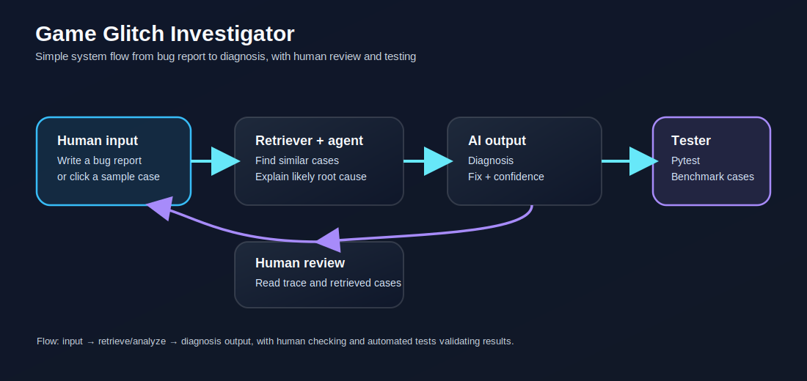

# Game Glitch Investigator

Game Glitch Investigator is a local applied-AI debugging assistant that analyzes bug reports, retrieves similar cases from a built-in knowledge base, and returns a likely root cause with a confidence score. It was extended from an earlier Streamlit number-guessing game into a more realistic reasoning system that explains how it reaches a diagnosis.

If you are new to the project, think of it this way: the old game asked the player to guess numbers. This version asks you to describe a bug or confusing behavior in plain English, then the assistant explains what kind of issue it looks like and why.

## Original Project

The original project was a Streamlit guessing game that used session state, score tracking, difficulty levels, and hint feedback. Its purpose was to demonstrate basic game logic and state handling, but it was not yet an AI system.

## What This Version Does

This version turns the project into a debugging assistant that can:

- classify a glitch report into a likely bug pattern,
- retrieve similar cases from a local case library,
- explain its reasoning trace step by step,
- assign a confidence score,
- and run a reliability benchmark across known reports.

## What To Ask

The app is meant for bug reports, not gameplay input. Good reports describe symptoms such as:

- "The secret number changes every time I click submit."
- "Invalid input still uses an attempt."
- "The hints point the wrong way."
- "Difficulty changes but the secret does not reset."

You can also use the sample buttons in the sidebar to see how the assistant reacts.

## Architecture

The system has four main parts:

1. Streamlit UI in `app.py` for user input, sample reports, and benchmark controls.
2. Retrieval and diagnosis logic in `logic_utils.py`.
3. Guardrails and logging through empty-input handling and JSONL trace logging.
4. A benchmark summary that evaluates the assistant on curated bug reports.

Data flows from bug report input to report analysis, retrieval, root-cause ranking, confidence scoring, and final explanation.

The simple diagram below shows the main components, the input-to-output flow, and where humans and pytest-based testing check the AI results.

Architecture diagram:

## Setup

1. Install dependencies with `pip install -r requirements.txt`.
2. Run the app with `python -m streamlit run app.py`.
3. Run tests with `python -m pytest`.

## Sample Interactions

Example 1:

- Input: "The secret number changes every time I click submit in Streamlit."
- Output: Streamlit rerun state bug
- Confidence: high
- Fix: store game state in `session_state` and only reset it when difficulty changes.

Example 2:

- Input: "My invalid string input still uses up an attempt and affects the score."
- Output: input validation bug
- Confidence: medium to high
- Fix: reject invalid input before decrementing attempts or changing the score.

Example 3:

- Input: "The hints say go higher when the guess is already too high."
- Output: hint direction bug
- Confidence: high
- Fix: keep the hint text aligned with the comparison result.

## Testing Summary

The project includes pytest coverage for retrieval ranking, diagnosis output, the empty-input guardrail, and the benchmark summary. The benchmark reports the assistant accuracy and average confidence across curated cases so the system is measurable instead of purely demo-driven.

## Design Decisions

- I used a local knowledge base and heuristic scoring so the project works reproducibly without external APIs.
- I modeled the assistant as a short agentic workflow: analyze, retrieve, hypothesize, and explain.
- I kept the implementation simple enough to test quickly inside a class project while still satisfying the applied-AI rubric.

## Reflection

This project taught me that AI systems become more trustworthy when they show evidence, not just answers. It also showed me that a small deterministic retrieval pipeline can still feel like an AI assistant if the reasoning steps are explicit and the output is evaluated.

For the full reflection prompts (AI collaboration, biases, limitations, and testing outcomes), see `reflection.md`.

## Grading Artifacts

- Model card: `model_card.md`
- Full reflection prompts response: `reflection.md`
- Architecture diagram: `assets/architecture-diagram.svg`
- Test suite: `tests/test_game_logic.py`

## Portfolio Notes

- Loom walkthrough: https://www.loom.com/share/789845a1a053436f87a67c666f8c7f11
